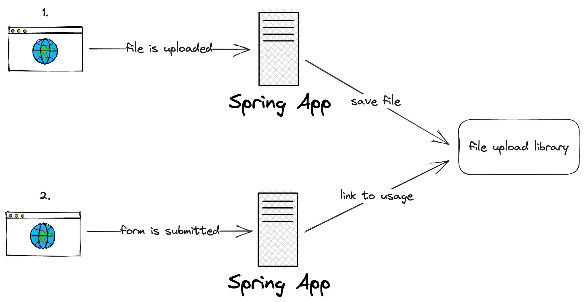
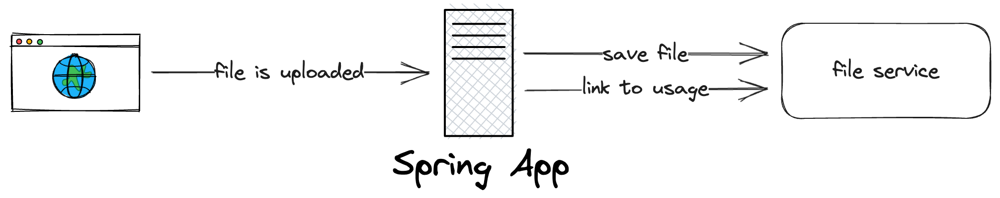

# Should we link files on form submission?

- Deciders: Danny Betts, Harshid Dattani, Chris T, James B
- Date: 2023-05-19

## Context and Problem Statement

Files need to be linked to a business usage. There are currently two implementations which affect how files are attached to their business usage.

The most common behaviour is that files are automatically linked when a file is uploaded. This is because the endpoints are contextual and the linking can happen automatically.

Is the form page is refreshed, any filled in fields will be wiped, but the uploaded files will remain. This makes the form pages somewhat inconsistent but also saves the user having to re-upload files.

Some projects have implemented a status flag which controls this behaviour and makes the uploaded file behaviour consistent with the other fields in the form. That being, if the form is refreshed without submission, all the data is reset.

## Decision Drivers

- Minimise inconstant behaviour across Digital projects
- Minimise duplicated code across Digital projects
- Compatibility with services which already have file upload functionality
- No copy; pasting code from other projects

## Decision Outcome

Let the consumer decide where they want to link files to their usages. It's not possible to enforce that they are linked at form submission time and there will always be room for error.

The `FileService` will implement a `linkToUsage` method which consumers will be able to call from anywhere.

## Considered Options

1. Link the files on form submission
2. Link the files on file upload
3. Make both options available and let the consumer use whichever one they want

## 1. Linking the files on form submission

The diagram below models the requests and how the files are linked



The library will implement a method which the consumers will use to link the files to the usages. For example:

```java
package co.uk.fivium.fileuploadlibrary;

public class FileService {

  /**
   * @param uploadedFiles Nested FDS forms containing information about the uploaded files.
   */
  public void linkToUsage(Collection<FileUploadForm> uploadedFiles) {
  }
}
```

>**There will be additional params to link the file to the business usage. [See here](./4-file-properties.md)**

```java
package uk.gov.project.consents;

@Controller
@RequestMapping("{consentId}")
class ConsentController {

  private final ConsentService consentService;
  
  @PostMapping
  ModelAndView submitEmissionsForm(@PathVariable UUID consentId, @ModelAttribute("form") EmissionsForm form) {
    consentService.saveForm(form);
  }

}

@Service
class ConsentService {
  
  private final ConsentRepository repository;
  private final FileService fileService;
  
  @Transactional
  public void saveForm(EmissionsForm form) {
    repository.save(form);
    fileService.linkToUsage(form.documents());
  }
  
}
```

Pros:

- A single API to link files to usages
- Consistent behaviour for file uploads and other form inputs

Cons:

- If a user refreshes the page, they need to re-upload the files

## 2. Linking the files on upload

In this option, as soon as the file is uploaded, it's linked to its usage. This means when saving the form on submission, there won't be any file linking.

>**The consumer will still need to call into the fileService to save the file descriptions**

The diagram below models what happens when a file is uploaded



Pros:

- The user doesn't need to worry about re-uploading their files

Cons:

- Potentially more confusing since you'd need to save the file description on submission, and linking information on file upload

## 3. Make both options available and let the consumer use whichever one they want

Pros:

- The most flexible option

Cons:

- Introduces differences between projects or even different areas within the same project
- More difficult to test since the linking could be done in multiple places
