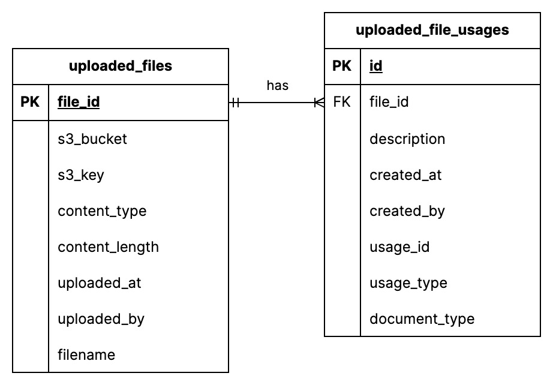

# How will files be handled when copying applications forward?

- Deciders: Danny Betts, Harshid Dattani, Chris T, James B
- Date: 2023-05-23

## Context and Problem Statement

Some services version their applications. Applications can have multiple files attached in several locations, and should ideally be kept separate from prior versions.

The `FileService` will make available methods in its API which will enabled consumers to request copying forward of files. For example

```java
package uk.co.fivium.fileuploadlibrary;

public class FileService {

  // find the files
  public Optional<UploadedFile> find(UUID fileId) {
  }

  public List<UploadedFile> find(String usageId, UsageType usageType) {
  }

  public List<UploadedFile> find(String usageId, UsageType usageType, DocumentType documentType) {
  }

  // use these methods to copy them forward
  public void copy(UploadedFile uploadedFile, String newUsageId) {
    // usageType and documentType are kept the same as UploadedFile
  }

  public void copy(UploadedFile uploadedFile, String newUsageId, String newUsageType) {
    // documentType is kept the same as UploadedFile
  }
  
  public void copy(UploadedFile uploadedFile, String newUsageId, String newUsageType, String newDocumentType) {
    // the file is copied but all the properties are set to the new options
  }

}
```

## Decision Drivers

- Ease of implementation for consuming services
- Minimise duplicated code across Digital projects
- No copy; pasting code from other projects

## Decision Outcome

1. Files are duplicated on copy forward

## Considered Options

1. Files are duplicated on copy forward
2. The same uploaded file is linked to another usage

## Pros and Cons of the Options

### 1. Files are duplicated on copy forward

The file is copied in S3 and a completely new usage is created for the consumer. All the properties of that file such as description will be stored as a new row in the database.

Pros:

- Very simple data model

Cons:

- Files will take up more space in S3

### 2. The same uploaded file is linked to another usage

Here, the file will not be copied in S3. Instead, the data model will need to change to decouple various information from each file. Things includes its usage and description. This will result in more tables being created in consumer applications



Pros:

- Files will not take up more space in S3

Cons:

- The data model will be more complex
